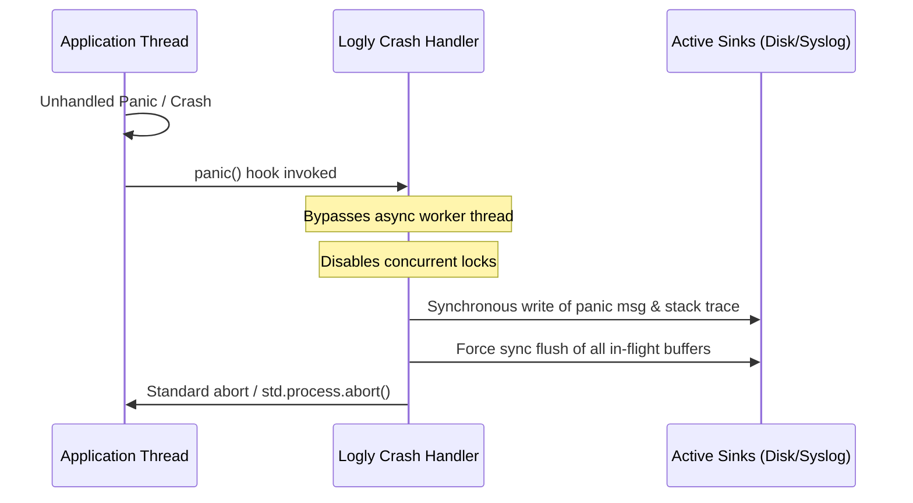

# Global Crash & Panic Handler

In standard production operations, application crashes and unhandled panics represent the most critical windows of diagnostic value. However, because highly efficient logging libraries rely on asynchronous queuing and background flush workers, the default behavior during a sudden exit is often to **lose in-flight logs** because the runtime is aborted before the buffers can drain.

Logly solves this problem using a dedicated **Global Panic Handler** that intercepts process-level crashes, bypasses standard asynchronous locks, flushes all active buffers, and synchronously logs crash context and stack traces to all active sinks before the process shuts down.

---

## Architecture Overview

Standard async logging queues messages in ring buffers and flushes them to disk on a thread pool or timer. When an unhandled panic occurs in standard code, the OS halts all threads and terminates the process immediately. 



By registering Logly's panic hook:
1. Standard asynchronous queuing is immediately bypassed during a panic.
2. Active locks on files and sockets are handled safely without causing deadlocks.
3. System diagnostics are captured at the exact moment of failure.
4. Active sinks are flushed synchronously to ensure absolute data persistence.

---

## API Reference

### Registering the Handler

To enable global panic and hardware crash trapping, register your active logger instance with the `logly.crash` subsystem:

```zig
const std = @import("std");
const logly = @import("logly");

// Optional: Enable the global panic hook at process-level
pub const panic = logly.panic;

pub fn main() !void {
    var gpa = std.heap.DebugAllocator(.{}){};
    defer _ = gpa.deinit();
    const allocator = gpa.allocator();

    const logger = try logly.Logger.init(allocator);
    defer logger.deinit();

    // Register our active logger for panic and crash signal handling
    logly.crash.registerLogger(logger);
    defer logly.crash.unregisterLogger();

    // Alternatively, you can use the shorter public aliases:
    // logly.crash.register(logger);
    // defer logly.crash.unregister();
    //
    // Other ergonomic aliases include: logly.crash.setup/reset and logly.crash.init/deinit.

    try logger.info("Process initialized. Panic and OS crash handlers are active.", @src());
}
```

### Forcing a Panic Log

You can manually trigger a panic dump through the logger without aborting the process for testing or custom recovery paths:

```zig
try logger.logPanic("Recoverable failure: custom panic condition triggered");
```

---

## Process Crash Callbacks

In advanced setups, you might want to execute custom telemetry reporting or notification logic immediately when a crash occurs (for example, notifying a service like Sentry or Rollbar). You can register a global crash callback using `setCrashCallback` (or its ergonomic aliases `onCrash`, `setCallback`):

```zig
fn customCrashCallback(msg: []const u8) void {
    // msg contains the formatted crash details and stack trace
    sentry.captureMessage(msg);
}

// Register the callback
logly.crash.setCrashCallback(&customCrashCallback);

// Clear the callback when shutting down
defer logly.crash.setCrashCallback(null);
```

> [!WARNING]
> Keep crash callbacks extremely fast, minimal, and allocation-free. If a crash occurs due to Out of Memory (OOM), attempting to allocate memory inside the callback will trigger another crash.

---

## Under-the-Hood: OS-Level Crash Trapping

Logly registers low-level handlers depending on the host operating system:

* **Windows Exception Trapping**: Sets up a **Vectored Exception Handler (VEH)** using win32 API calls (`AddVectoredExceptionHandler`). It intercepts hardware-level signals such as Access Violations (`STATUS_ACCESS_VIOLATION`), division by zero, stack overflows, and illegal instructions, translates them to human-readable names, force-flushes sinks, and prints fallbacks before continuing search.
* **POSIX Signal Trapping**: Registers standard signal handlers (`sigaction`) on Linux and macOS for signals like `SIGSEGV`, `SIGILL`, `SIGFPE`, `SIGABRT`, and `SIGBUS`. It intercepts hardware aborts, logs details, force-flushes sinks, and gracefully passes control back to standard OS default handlers (`SIG.DFL`) to allow default core dumps and clean terminations.

---

## Best Practices

> [!IMPORTANT]
> The global panic and crash hooks are designed to write directly to disk or standard output without allocating memory. In an Out of Memory (OOM) scenario, further allocations could crash the allocator, so the panic hook uses pre-allocated stack buffers and safe platform APIs.

* **Register Early**: Call `logly.crash.registerLogger` (or its alias `logly.crash.register`) as soon as your logger is initialized in `main` to catch failures during startup.
* **Unregister Gracefully**: Use a `defer logly.crash.unregister()` immediately after registration to clean up global references when exiting normally.
* **Bypass Async**: The crash subsystem automatically bypasses asynchronous thread pool queues during failure, writing synchronously to ensure logs are fully captured on crash. Do not try to perform asynchronous network requests inside panic hooks. Always direct panic logs to reliable, local, or connection-oriented sinks.
