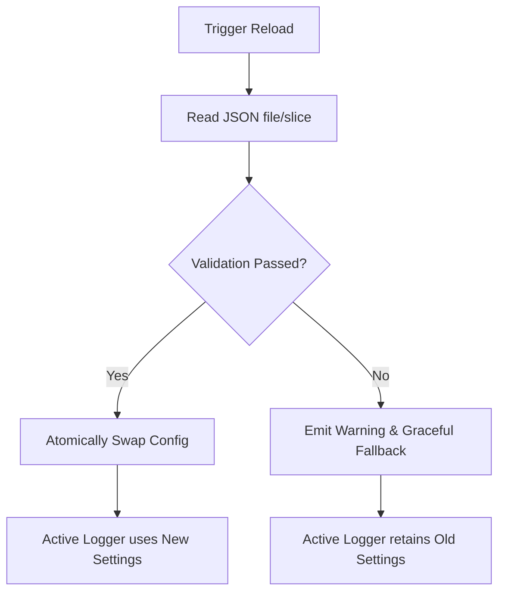

# Zero-Downtime Hot-Reload

In long-running production environments, restarting a service to adjust log verbosity (e.g., turning on `DEBUG` or `TRACE` logs during an active incident) can be highly disruptive, costly, and may clear the very in-memory state you are trying to inspect.

Logly provides high-performance **Zero-Downtime Hot-Reloading** of its configuration. This allows developers and operators to dynamically adjust active log levels, sinks, formats, and rules at runtime from a JSON configuration file without stopping the process or dropping a single log record.

---

## How It Works

Logly leverages atomic state transitions to safely swap its active configuration struct. When a reload is triggered:
1. The new JSON configuration is loaded and validated.
2. If validation succeeds, active sinks, levels, and filter states are updated.
3. If parsing fails (e.g., due to invalid JSON syntax), the logger catches the error, logs a warning, and **falls back gracefully** to the existing configuration. This guarantees that your application never crashes or stops logging due to a configuration syntax error.



---

## Triggering a Reload

To reload configuration dynamically, you can use the `reloadFromFile` method on your logger instance:

```zig
const std = @import("std");
const logly = @import("logly");

pub fn main() !void {
    var gpa = std.heap.DebugAllocator(.{}){};
    defer _ = gpa.deinit();
    const allocator = gpa.allocator();

    // Start the logger with standard default settings
    const logger = try logly.Logger.initWithConfig(allocator, logly.Config.default());
    defer logger.deinit();

    try logger.info("Logger started. Waiting for reload trigger...", @src());

    // ... simulate runtime event or signal check ...

    // Reload configuration from disk
    logger.reloadFromFile("config/logging.json") catch |err| {
        // Fallback is handled automatically, but you can inspect the error here
        std.debug.print("Failed to reload config: {}\n", .{err});
    };

    try logger.debug("This debug log is now visible if the JSON enabled debug level!", @src());
}
```

---

## JSON Config Format

The configuration file is a simple, standard JSON structure that mirrors Logly's `Config` fields:

```json
{
  "level": "debug",
  "global_console_display": true,
  "global_file_storage": true,
  "color": true,
  "json": false,
  "auto_flush": true,
  "msgpack": false
}
```

### Supported JSON Keys

* **`level`**: String representing the log level. Case-insensitive (`"trace"`, `"debug"`, `"info"`, etc.).
* **`global_console_display`**: Boolean to enable/disable writing to the console.
* **`global_file_storage`**: Boolean to enable/disable file writing.
* **`color`**: Enable/disable colored CLI output.
* **`json`**: Toggle structured JSON formatting.
* **`msgpack`**: Enable MessagePack binary formatting for storage efficiency.

---

## Best Practices

> [!NOTE]
> Hot-reloading is highly efficient and designed for safe execution in multi-threaded environments. Standard lock-free reads protect active log calls while configuration swapping takes place.

* **Validate Before Reload**: If using a custom ingestion pipeline, parse the JSON slice first using `Config.loadFromJson` before swapping to ensure correct configuration schemas.
* **Use SIGUSR1 / SIGHUP**: On Unix-like systems, set up a signal handler for `SIGHUP` or `SIGUSR1` that triggers `logger.reloadFromFile` to change settings without standard API exposure.
* **Incident Tuning**: Keep a production configuration template with the level set to `"info"` and a backup incident configuration with the level set to `"debug"`. Swap the file links at runtime to instantly gain detailed logs.
